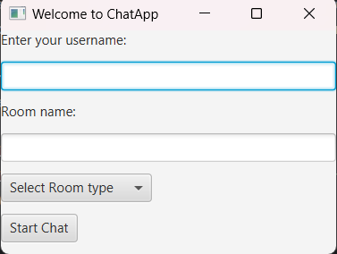

# ChatApp
Chat Messaging App is a Java-based object-oriented programming (OOP) project designed to 
facilitate communication by allowing users to send and receive real-time messages. User-friendly GUI is 
designed using JavaFx to enhance the experience. The project incorporates various OOP concepts such 
as modularity, hierarchy, composition, reuse, encapsulation, subtyping, information hiding, abstraction, 
inheritance, polymorphism, and exception handling.


## Getting started
1. Clone repo:
```bash
$ git clone https://github.com/HodIs7ag/ChatApp.git
```
2. Use Intellij, Eclipse or any IDLE supports Maven and JavaFx
3. compile the project
4. Run Server class to initialize the Server
5. launch the app by running ChatAppGUI class two times or more
6. Welcome window will pop-up
   
## User Interface
#### Welcome window

- Username: textField where user inserts his desired name. once inserted User object is created
- roomName: Type room name, new room will be created if not already existed.
-  Room Selection: the program supports Public and private chats
- Start Chat: Button to send the inserted data to back-end for verification, then Shows Chat Window

