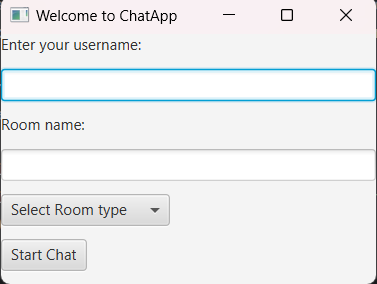
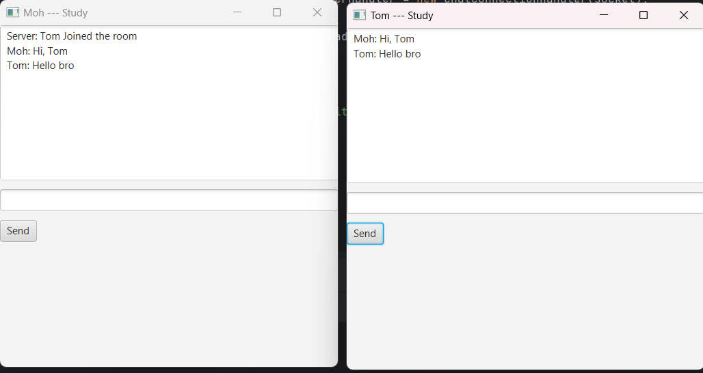

# ChatApp
Chat Messaging App is a Java-based object-oriented programming (OOP) project designed to 
facilitate communication by allowing users to send and receive real-time messages. User-friendly GUI is 
designed using JavaFx to enhance the experience. The project incorporates various OOP concepts such 
as modularity, hierarchy, composition, reuse, encapsulation, subtyping, information hiding, abstraction, 
inheritance, polymorphism, and exception handling.


## Getting started
1. Clone repo:
```bash
$ git clone https://github.com/HodIs7ag/ChatApp.git
```
2. Use Intellij, Eclipse or any IDLE supports Maven and JavaFx
3. compile the project
4. Run `Server` class to initialize the Server
5. launch the app by running `ChatAppGUI` class two times or more
6. Welcome window will pop-up
   
## User Interface
#### Welcome

- Username: textField where user inserts his desired name. once inserted User object is created
- roomName: Type room name, new room will be created if not already existed.
-  Room Selection: the program supports Public and private chats
- Start Chat: Button to send the inserted data to back-end for verification, then Shows Chat Window
#### Chat Room

- Label: Username --- Room
- MessagesArea: All Sent and received messages appear here
- TextField: Insert text to be sent
- Send: button to broadcast the message to connected users

## How it functions
#### Java Sockets
In the context of this chat application:

- **Server Socket**: This is created on the server side using the `ServerSocket` class. The server socket listens for incoming connection requests from clients. When a connection request is received, the server socket accepts the connection, resulting in a user socket.

- **User Socket**: When a client wants to join the chat, it creates a user socket using the `Socket` class. This user socket connects to the server socket, allowing for two-way communication between the client and the server.

#### Message Broadcasting

When a user sends a message, it is transmitted through their user socket to the server. The server then distributes this message to all other users who are connected and have joined the same chat room. This is achieved by iterating over all active user sockets associated with that room and sending the message to each one.

**For further details regrading OOP download the [project report](OOP_report.pdf)**


